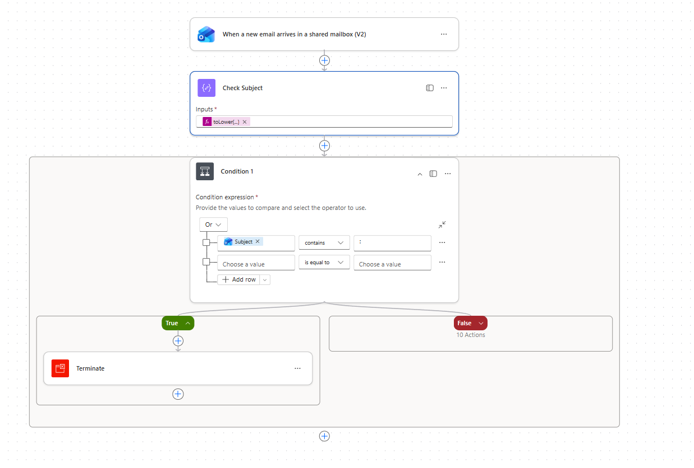
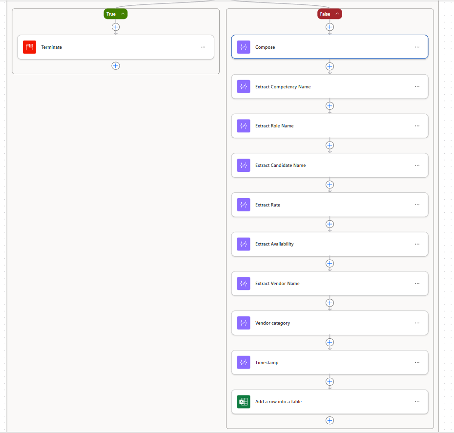

# Candidate Intake Automation

## Problem

Vendor emails containing candidate information had to be manually reviewed and copied into an Excel tracker. This process was time-consuming and prone to human error.

## Goal

Automate extraction of candidate data from vendor emails and store it in Excel without manual intervention.

## Solution

I built a Power Automate workflow that:

- Detects incoming vendor emails automatically
- Extracts structured candidate information from email content
- Transfers the data directly into the Excel tracker
- Standardizes the data entry format
- Eliminates the need for manual copying

## Design Decisions

The workflow was designed to prioritize reliability and simplicity. 
I structured the automation to trigger only on vendor emails with specific format to avoid false activations. 
Data extraction was standardized to ensure consistent Excel formatting. 
The flow was built with scalability in mind so additional data fields can be added in the future.

## Tools Used

- Microsoft Power Automate
- Outlook email connectors
- Excel Online

## Impact

This automation eliminated approximately 115 hours of manual work annually.

This year alone, the team processed around 2,300 candidates. Manually logging each candidate took about 3 minutes, which would total roughly 115 hours of repetitive administrative work.

Beyond time savings, the automation improved data consistency, reduced human errors, and ensured that no candidate records were missed.

## Workflow Overview

